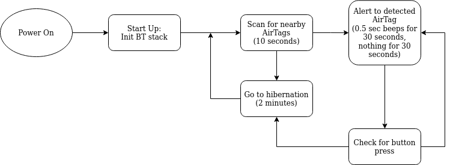

# AirFlag
Since Apple has released their AirTag product, I have noticed several instances of these cheap tracking devices used in nefarious purposes [1](https://www.nytimes.com/2021/12/30/technology/apple-airtags-tracking-stalking.html) [2](https://www.cnet.com/tech/services-and-software/apple-airtags-can-be-used-to-track-you-how-to-protect-yourself/).

In order to avoid false positives, currently iOS devices will check for nearby unknown AirTags when reaching a known location, such as the owner's hosue [[Adam Catley](https://adamcatley.com/AirTag.html#privacy-concerns)]. To me, this seems too little too late. 

The goal of the project is to detect nearby airtags in disconnected or lost modes.

<b>If you find an unkown AirTag, please follow the instructions listed here:
https://support.apple.com/en-us/HT212227</b>

You can also remove the battery of the AirTag by ....

# Functionality (implemented and planned)

<figure>
    
</figure>

# Theory of Oporation
<i>See Adam Catley's comprenesive [tear down and reverse engineer](https://adamcatley.com/AirTag.html) for more info on AirTags.</i>

The AirTag has several states. The two that we are concerned about are <i>Disconnected</i> and <i>Lost Mode</i>. In these two states, the AirTag is boadcasting it's identity for nearby iPhones to detect. The iPhone will then report the public key in the AirTag's broadcast to the FindMy network.
 
<figure>
    
    <figcaption>How Apple uses the FindMy Network to locate lost devices. <i>Source: Apple.com</i></figcaption>
</figure>
 
Luckily, we can also detect these broadcasts using any BLE device. In this specific case, I am using the ESP32. 

### AirTag GAP Packet

The BLE Generic Access Profile (GAP) is used to provide information to BLE hosts on what the client device is.
 
<table>
<caption>AirTag GAP Packet Description. <i>Source: Adam Catley</i></caption>
<tr>
<th>Byte #</th>
<th>Value</th>
<th>Description</th>
</tr>
<tr>
<td>0</td>
<td>0x1E</td>
<td>Advertising data length: 31 (the maximum allowed)</td>
</tr>
<tr>
<td>1</td>
<td>0xFF</td>
<td>Advertising data type: Manufacturer Specific Data</td>
</tr>
<tr>
<td>2-3</td>
<td>0x004C</td>
<td>Apple's company identifier (Actuall order in packet is 4C 00)</td>
</tr>
<tr>
<td>4</td>
<td>0x12</td>
<td>Apple's payload type to indicate a FIndMy Network broadcast</td>
</tr>
<tr>
<td>5</td>
<td>0x19</td>
<td>Apple payload length (31 - 6 = 25 = 0x19)</td>
</tr>
<tr>
<td>6</td>
<td>0x10</td>
<td>Status byte</td>
</tr>
<tr>
<td>7-31</td>
<td>Varies</td>
<td>Contains the public key used to identify the AirTag's owner within the FindMy Network. Changes daily.</td>
</tr>
</table>
 

Since the portion of the packet that contains the identification data is encrypted and changes on a daily basis, we won't be able to track specific AirTags. That is out of the scope of this project.

The only information we need to detect if there is an AirTag is the information in the packet header (Bytes 0-6).

# Future Plans
Once the basic functionality is implemented software, I plan to move on to creating several circuit boards that allow for integration into a vehicle:
1. OBD II port
2. 12V Aux power
3. USB powered
4. Maybe a keychain type device
